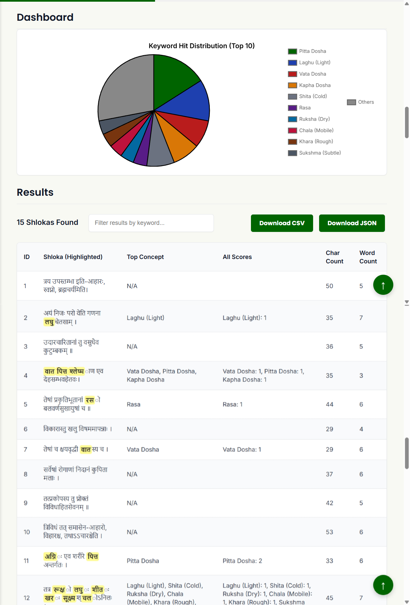

---
# Page title
title: 'ShlokaAI: The Smart Sanskrit Analysis Platform'

# JOSS tags
tags:
  - Sanskrit
  - Ayurveda
  - Digital Humanities
  - NLP
  - Text Analysis
  - BAMS
  - Research Software

# Paper authors
authors:
  - name: Sparsh Varshney
    given-names: Sparsh
    surname: Varshney
    orcid: 0009-0004-7835-0673
    affiliation: 1
    corresponding: true

# Paper affiliations
affiliations:
  - index: 1
    name: Amidha Ayurveda, India

# Paper date
date: 4 November 2025

# Paper bibliography
bibliography: paper.bib
---

# Summary

ShlokaAI is an open-source, bilingual (English/Hindi) web-based tool designed to make the analysis of Sanskrit texts accessible to students and researchers. Many foundational scientific and philosophical texts, such as those in Ayurveda (traditional Indian medicine), are composed in Sanskrit. For students and researchers, the task of finding all mentions of a specific concept (e.g., a "body humor" or "herbal property") across thousands of verses (*shlokas*) is a slow, manual, and complex process.

ShlokaAI automates this "text-mining" task. It provides a simple, no-code interface where users can load pre-built templates or create their own "Concept Maps." The tool then processes an uploaded text file, highlights all relevant terms, and presents the findings in an interactive dashboard (\autoref{fig:dashboard}), a filterable table, and a modal that shows the context of each verse. This allows users to quickly see the distribution of concepts in a text and export the classified data as CSV or JSON for further research.

# Statement of Need

The foundational texts of Ayurveda, such as the *Caraka Saṃhitā* and *Suśruta Saṃhitā*, are written in Sanskrit. Research in this field, as well as the education of BAMS (Bachelor of Ayurvedic Medicine and Surgery) students, requires *Śāstrārtha* (textual study and comprehension). This traditionally involves scholars manually searching and collating *shlokas* (verses) related to specific concepts—a laborious, time-consuming process that is difficult to scale for comprehensive analysis.

While many text-mining and Natural Language Processing (NLP) tools exist for modern languages, Sanskrit presents unique challenges (e.g., complex morphology and *Sandhi*, or euphonic combination). Furthermore, generic Digital Humanities tools are often not tailored to the specific conceptual framework of Ayurveda (e.g., *Dosha*, *Dhatu*, *Guna*).

ShlokaAI is built to fill this specific gap. It provides a simple, no-code interface for researchers to build custom-defined conceptual maps (e.g., mapping "Vata," "Vayu," and "Anila" all to the concept of "Vata Dosha") and apply them to a corpus. It bridges the gap between traditional textual study and modern digital analysis. This empowers researchers to perform quantitative analysis of textual content and enables BAMS students to create digital study aids more efficiently.

ShlokaAI is, to our knowledge, the first open-source, citable software tool specifically designed for this type of user-driven, concept-centric analysis of Ayurvedic Sanskrit texts. It complements larger dataset projects, such as the *Siddhanta Kosha* [@SiddhantaKosha_2025] or the *Amidha Ayurveda Herb Database* [@HerbDatabase_2025], by providing the *tool* to analyze texts for those very concepts. The software itself is archived with Zenodo [@ShlokaAI_2025].

# Figures

{ width=100% }

# Acknowledgements

This software was developed as an independent, open-source project by Amidha Ayurveda to support digital research and education in the field of Ayurveda.

# References
